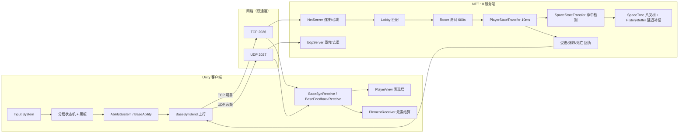

# ElementalWar · 元素战争

> 一个基于 **Unity + 自研 .NET 服务端** 的多人联机 FPS 原型。  
> 核心玩法是「**元素附着 + 元素反应**」：把火、水、冰、风、雷、岩、草七种元素打在目标身上，按优先级依次结算蒸发、融化、超载、结晶等 11 类反应。

---

## 目录

- [1. 项目简介](#1-项目简介)
- [2. 玩法特性](#2-玩法特性)
- [3. 技术栈与环境要求](#3-技术栈与环境要求)
- [4. 目录结构](#4-目录结构)
- [5. 架构总览](#5-架构总览)
- [6. 客户端核心系统](#6-客户端核心系统)
- [7. 服务端核心系统](#7-服务端核心系统)
- [8. 协议与代码生成](#8-协议与代码生成)
- [9. 快速开始](#9-快速开始)
- [10. 编辑器工具一览](#10-编辑器工具一览)
- [11. 编码约定](#11-编码约定)
- [12. 已知限制与 TODO](#12-已知限制与-todo)
- [13. 致谢与素材版权](#13-致谢与素材版权)

---

## 1. 项目简介

ElementalWar 是一套**完整闭环**的联机 TPS 技术验证工程：从出生点烘焙、匹配开局、双通道网络、服务端权威命中检测，到元素附着、反应结算、Buff/护盾与飘字表现，全部自己实现，不依赖任何第三方网络/同步框架。

工程里有两个可独立运行的部分：

| 部分  | 位置        | 技术                    | 职责                       |
| --- | --------- | --------------------- | ------------------------ |
| 客户端 | `Assets/` | Unity 2022.3 LTS + C# | 输入、表现、状态机驱动、元素反应结算       |
| 服务端 | `Server/` | .NET 10 控制台程序         | 匹配、房间管理、状态中转、权威命中检测、伤害判定 |

两端通过 **Protobuf + TCP/UDP 双通道**通信；协议文件单一来源、一键生成到双端。

---

## 2. 玩法特性

### 元素系统

- **7 种元素**：火 / 水 / 冰 / 风 / 雷 / 岩 / 草（`ElementType` 为 `[Flags]` 位掩码，方便做组合键）
- **元素附着**：`ElementAttachment` 维护 `TotalElement`（已附着元素位标志）与 `ElementContentDic`（每种元素的附着量），用于计算反应消耗与残留伤害
- **11 类元素反应**（数据驱动，`ElementReactionMap` 配置）

| 元素组合        | 反应  | 实现类                               |
| ----------- | --- | --------------------------------- |
| 火 + 水       | 蒸发  | `EvaporationReaction`             |
| 火 + 冰       | 融化  | `MeltReaction`                    |
| 火 + 雷       | 超载  | `OverloadReaction`                |
| 冰 + 雷       | 超导  | `SuperconductionReaction`         |
| 水 + 冰       | 冻结  | `FrozenReaction`                  |
| 水 + 雷       | 感电  | `ElectrificationReaction`         |
| 雷 + 草       | 原激化 | `OriginalIntensificationReaction` |
| 火 + 草       | 燃烧  | `BurnReaction`                    |
| 水 + 草       | 绽放  | `BloomReaction`                   |
| 火/水/冰/雷 + 风 | 扩散  | `DiffusionReaction`               |
| 火/水/冰/雷 + 岩 | 结晶  | `CrystalReaction`                 |

- **反应优先级**：`ReactionPriorityTable` 为每种「后手元素」配置一串前手元素顺序，一次攻击可依次触发多个反应，直到元素量耗尽（见 `ElementReceiver.ReceiveElement`）
- **元素 Buff**：冻结、燃烧、感电、激化、元素护盾，均继承 `BaseElementBuff`
- **元素护盾**：`ElementShieldBuff` + `ElementShield`（特效）+ 视图与状态同步

### 战斗

- 射击（射线命中）、投掷手雷（抛物线轨迹 + 爆炸）、瞄准、开镜 FOV、换弹、跑动、跳跃、死亡与复活
- 服务端权威命中：客户端只上报射线与包围盒，命中判定与伤害由服务端计算后回执
- 受击方向指示（`HitDir`）、伤害/反应飘字（`DynamicText`）、击杀提示（`KillView`）、HP 条

### 联机

- 双人房间匹配（`ROOM_PLAYER_COUNT = 2`），房内 **600 秒** 后自动结束
- TCP 长连接负责可靠消息与心跳，UDP 负责高频状态与命中请求
- 服务端对关键 UDP 包做**重传 + 去重**，对非关键包做**时间戳丢弃**（旧包直接忽略）

---

## 3. 技术栈与环境要求

| 项目              | 版本                                       |
| --------------- | ---------------------------------------- |
| Unity           | **2022.3.62f3c1**（LTS）                   |
| .NET SDK（服务端）   | **10.0**                                 |
| Google.Protobuf | 3.35.1                                   |
| UniTask / 协程    | 未使用第三方，全部基于 `Task` + `CancellationToken` |

主要 Unity 包（`Packages/manifest.json`）：

- `com.unity.inputsystem` 1.14.2 —— 新输入系统（`Player.inputactions`）
- `com.unity.textmeshpro` 3.0.7 —— 文本与飘字
- `com.unity.ugui` / `com.unity.timeline` / `com.unity.visualscripting`
- `com.unity.feature.2d` 2.0.1 —— 2D 特性集（UI / 贴图处理）
- `com.candidumgames.unitymmdtools` 0.5.1 —— MMD 模型（Lumine）导入

> 服务端工程 `Server/Server.csproj` 使用 `net10.0` + `ImplicitUsings` + `Nullable`，只依赖 `Google.Protobuf`。

---

## 4. 目录结构

```text
ElementalWar/
├─ Assets/
│  ├─ Scripts/
│  │  ├─ Manager/                     # 【ElementalWar.Foundation】基础设施
│  │  │  ├─ Base/                     #   Single / SingleMono / SingleSO 单例基类、BaseUI
│  │  │  ├─ Event/                    #   EventBus、EventType、EventInfo、RefAction
│  │  │  ├─ Framework/                #   UIManager、LoadingManager、PublicMono、Audio
│  │  │  ├─ Pool/                     #   ObjectPool、MonoObjectPool、PoolObj
│  │  │  ├─ Space/                    #   几何库：AABB / Sphere / Ray / SpaceTree(八叉树)
│  │  │  ├─ SettingData/              #   本地设置、网络设置（NetSettingData）
│  │  │  └─ Tool/                     #   Math 等工具
│  │  ├─ Net/                         # 【ElementalWar.Network】网络层
│  │  │  ├─ NetManager / Tcp / Udp     #   管理器与两条通道
│  │  │  ├─ Package/                  #   TcpPackage / UdpPackage / SendType
│  │  │  ├─ Message/                  #   protoc 生成的协议类（勿手改）
│  │  │  └─ Pool/                     #   MessagePool 消息对象池
│  │  ├─ StateMachine/                # 【分层状态机】
│  │  │  ├─ State / Edge / Condition   #   StateMachine、ManualStateMachine、SubStateMachine
│  │  │  ├─ Blackboard/               #   Blackboard、BlackboardTemplate
│  │  │  └─ Editor/                   #   状态编辑窗口（asmdef: StateMachine.Editor）
│  │  ├─ GamePlay/                    # 【ElementalWar.GamePlay】玩法层（含 Editor 子模块）
│  │  │  ├─ PlayerController/         #   控制器：Ability / SynSend / SynReceive / Element
│  │  │  ├─ PlayerView/               #   视图：插值移动、枪械、元素表现
│  │  │  ├─ Scene/                    #   静态场景、动态场景物件、VAT
│  │  │  ├─ Obj/Eff/                  #   特效：命中、投掷轨迹、元素护盾
│  │  │  ├─ UI/                       #   InitPanel / BeginPanel / LoadingPanel / GamePanel
│  │  │  └─ Manager/                  #   StaticSceneManager、SceneBKManager、玩家管理
│  │  ├─ ElementalWar.GamePlay.asmdef  #   根 asmdef
│  │  └─ *.asmdef                      #   Foundation / Network / GamePlay / GamePlay.Editor(Element.Editor)
│  ├─ Editor/                         # 编辑器工具（不在 asmdef 内，归 Assembly-CSharp-Editor）
│  │  ├─ Protobuf/                    #   ★ 协议单一来源：*.proto + Template
│  │  ├─ CreateCSharpMessage.cs        #   ★ 一键调用 protoc 生成双端 C# 消息
│  │  ├─ CreateProtobuf.cs             #   由模板新建 .proto
│  │  ├─ CreateStaticSceneAsset.cs     #   场景碰撞烘焙 → StaticSceneAsset
│  │  ├─ CreateServerStaticSceneAsset.cs #  导出为 Server/Scene/*.json
│  │  ├─ CreateBirthPointInfo.cs       #   导出出生点
│  │  ├─ CreateSceneBKAsset.cs / MeshMerge.cs
│  │  └─ VAT/                          #   顶点动画贴图烘焙工具（VATCreator）
│  ├─ SO/                             # ScriptableObject 配置
│  │  ├─ StateMachine/                #   Player / PlayerAbility / Game 三套状态机资产
│  │  ├─ Element/                     #   PlayerReactionMap / PlayerPriorityTable / PlayerElementBuffMap
│  │  ├─ VAT/ SceneAsset/ SceneBKAsset/
│  ├─ Resources/                      # 运行时加载的预制体（MainPlayer/OtherPlayer/Gun/Grenade…）
│  ├─ Scenes/                         # GameScene.unity（主场景）、SampleScene.unity
│  ├─ Animation/ Art/ Input/ Plugins/ TextMesh Pro/
├─ Server/                            # ★ 专用服务器（.NET 10）
│  ├─ Program.cs                      #   入口：绑定 IP、启动 NetServer、拉起 Lobby
│  ├─ NetServer.cs / UdpServer.cs / TcpClient.cs / NetUtility.cs
│  ├─ Package/ Event/ Message/        #   与客户端对应的镜像实现（含 protoc 生成的消息）
│  ├─ Space/                          #   几何库与八叉树（服务端版，独立于 Unity）
│  ├─ Scene/                          #   Scene_1.json / BirthPoint.json（离线烘焙产物）
│  ├─ GamePlay/
│  │  ├─ Online/                      #   Lobby.cs / Room.cs 匹配与房间
│  │  ├─ PlayerStateTransfer.cs       #   状态中转总调度（10ms 主循环）
│  │  ├─ StateTransfer/               #   各中转器 + SpaceTransfer + Hit(SpaceItem/TriggerItem)
│  │  └─ AttackRequest/               #   命中请求结构（射线/爆炸/超绽放/范围元素伤害）
│  └─ Test/                           # RemoteTest / LocalOnlineTest 压测与联调入口
├─ Protoc/                            # protoc.exe + include（.proto 官方依赖）
├─ Protocol/                          # 协议输出预留目录
└─ *.slnx / *.csproj / ProjectSettings/ Packages/
```

---

## 5. 架构总览



设计要点：

1. **两端职责分离**：客户端负责输入采样、状态上报与表现；服务端负责匹配、房间、命中判定与伤害，是唯一的权威源。
2. **共享源码镜像**：`Message`（Protobuf 生成）、`Package`、`Event`、`Space`（几何/八叉树）在客户端与服务端各存一份。改动时**必须双端同步修改**。
3. **异步 + 队列**：网络收发、大厅循环、状态中转全部跑在 `Task` 上，跨线程数据一律经 `ConcurrentQueue` 交给主循环消费，避免锁竞争。

---

## 6. 客户端核心系统

### 6.1 分层状态机与黑板

- `StateMachine`（MonoBehaviour）持有 `anyState` / `initState` / `currState`，每条 `Edge` 挂一个 `Condition`；`anyState` 的出边优先判定，可实现「冻结/死亡打断一切」这类全局跳转。
- 状态资产用 ScriptableObject 配置，运行时 `Instantiate` 一份副本，**保证运行时数据不污染资产**。
- `SubStateMachine` 支持嵌套状态机（如 ShootState 内部再分 FireState / CoolingState）。
- `Blackboard` 是状态间的数据总线，`BlackboardTemplate` 用于黑板参数定义；`Ability`、`SynSend` 等都通过黑板读写位置、朝向、状态标志。
- 配置资产位于 `Assets/SO/StateMachine/`，分为三套：
  - `Player/`：Idle、Shoot、Throw、Frozen、Death、Any（含 `Frozen` 与 `Death` 的全局打断边）
  - `PlayerAbility/`：Idle、Run、Aim、Reload、Throw、Frozen、Death（能力状态切换）
  - `Game/`：Begin → Loading → Game → Death → End（对局流程）

### 6.2 Ability 系统

- `BaseAbility` 以 `[SerializeReference]` 多态序列化挂在 `AbilitySystem` 上，`AutoInject(Blackboard)` 完成依赖注入。
- `SetAbilities` 支持**运行期热插拔**：冻结时下发一份只含 Frozen/Death 的能力表，解冻后恢复，无需销毁重建玩家对象。
- 已实现能力：`MoveAbility`、`RunAbility`、`JumpAbility`、`ShootAbility`、`AimAbility`、`ReloadAbility`、`ThrowAbility`、`RotationAbility`、`CameraControlAbility`、`CameraFOVAbility`、`ElementTypeSelectAbility`、`CursorAbility`、`DeathAbility`。

### 6.3 元素反应结算

`ElementReceiver.ReceiveElement()` 是客户端元素结算的核心入口，流程为：

```text
收到元素攻击(message.ElementAttack)
  → ElementBuffSet.OnElementAttackTrigger()       # 减伤 / 增伤修正
  → ReactionPriorityTable.TryGetPriorityTable()    # 取该元素的反应优先级序列
  → 逐个前手元素匹配：
        ElementAttachment.TotalElement 是否附着？
        ElementReactionMap.TryGetReaction(前后手组合)
        BaseElementReaction.OnReaction()           # 消耗双方附着量
        BaseElementReaction.GetDamage()            # 计算反应伤害
        → MainPlayerHP.ReduceHP() + 飘字(reaction.name/color)
  → 仍有剩余元素量：写入 ElementAttachment，走普通元素伤害 + 触发元素 Buff
```

- `ElementReactionMap` / `ReactionPriorityTable` 均为 ScriptableObject，用 `SerializeReference` 存多态反应实例，可在 Inspector 里直接配置。
- 反应/优先级均配有自定义 `PropertyDrawer`（`ElementReactionListDrawer`、`ElementReactionMapEditor` 等），方便可视化编辑。

### 6.4 网络层

- `NetManager`（`SingleMono<NetManager>`）统一入口：
  1. `StartClient()` → 读取 `NetSettingData` 的 TCP/UDP 地址（默认 `127.0.0.1:2026` / `:2027`）
  2. `TcpManager` 建链 → 连接成功后 `OnConnected` 拉起 `UdpManager`
  3. 启动 `TcpHeartLoop`，每 **5 秒** 发一次 `HeartMessage`
- 收发模型：接收线程只做解析并入队 `ConcurrentQueue<NetPackage>`，主线程 `Update` 出队 → `EventBus` 分发 → `MessagePool` 回收消息对象，避免 GC 抖动。
- 通道选择由 `NetPackage.sendType` 决定：`SendType.Tcp`（可靠、低频）/ `SendType.Udp`（高频、可丢）。
- 收到带 `IsResponse` 的 UDP 包时自动回 `UdpResponseMessage` 确认（`OnNeedResponseMessage`）。


### 6.5 状态同步与表现

`MainPlayerNetSyn` 是本机的同步中枢，由两部分组成：

| 类型                    | 作用    | 已实现                                                                                                                                                                                                                            |
| --------------------- | ----- | ------------------------------------------------------------------------------------------------------------------------------------------------------------------------------------------------------------------------------ |
| `BaseSynSend`         | 本机上行  | `PosStateSynSend`（默认每 0.02s 上报位置/朝向）、`JumpStateSynSend`、`ShootStateSynSend`、`ThrowStateSynSend`、`FrozenStateSynSend`、`DeathStateSynSend`、`ElementShieldStateSynSend`、`BoundStateSynSend`（包围盒，供服务端命中检测）、`ElementAttachmentSend` |
| `BaseFeedbackReceive` | 服务端回执 | `HitFeedbackReceive`（受击/元素结算 + 受击方向指示）、`ExpHitFeedbackReceive`、`AOEFeedbackReceive`、`PosFeedbackReceive`（位置纠正）                                                                                                                 |

远端玩家由 `OtherPlayer` + `SynReceive/` 下的接收器驱动：位置插值（`PlayerMove`）、跳跃、射击、投掷、冻结、死亡、护盾、元素附着表现。

表现层与 UI：

- `PlayerController`（视图）/ `PlayerGunController` / `PlayerElementView` / `ElementShieldView`
- `UIManager` + `BaseUI` 管理面板：`InitPanel`（服务器地址设置）、`BeginPanel`、`LoadingPanel`、`GamePanel`（`HPBar`、`FrontSightView`、`GunView`、`GrenadeView`、`ElementAttachmentView`）
- `DynamicTextManager` + `DynamicText` 负责伤害数字与反应名飘字，`KillView` 负责击杀提示

---

## 7. 服务端核心系统

### 7.1 启动、匹配与房间

```csharp
// Server/Program.cs
EventBus.Instance.AddListener<ClientPackage>(EventType.OnReceive, OnTextMessage);

var ip = NetUtility.GetLocalIPv4();
NetServer server = new();
server.Start(new IPEndPoint(ip, 2026), new IPEndPoint(ip, 2027));   // TCP 2026 / UDP 2027

Lobby lobby = new();                        // 匹配大厅
while (true) { if (Console.ReadLine() == "0") { server.Close(); break; } }
```

- **NetServer**：`SocketAsyncEventArgs` 异步 Accept，自增 `playerId`；维护 `_clientDic`（TCP 连接）与 UDP 端点 ↔ playerId 双向映射。后台 `ClearOverTimeLoop` 每 1s 检查心跳，**超过 10s 未收到 `HeartMessage` 判定超时**并触发 `OnPlayerDisconnect`。
- **Lobby**：10ms 主循环 + 四个 `ConcurrentQueue`（连接/断开/开始匹配/取消匹配）；玩家在 `_sleepPlayerSet`（空闲）、`_waitingPlayerSet`（匹配中）、`_playingPlayersDic`（游戏中）之间流转；凑满 2 人即建房。
- **Room**：
  1. 建房后向房内所有玩家下发 `PlayerRegistryMes`（含完整玩家列表与自己的 clientId）
  2. 等待每个客户端上报 `ClientStartMessage`
  3. 全部就绪 → 下发 `GameStateMessage { IsStart = true }` 并 `PlayerStateTransfer.Start()`
  4. 600 秒后自动 `StopRoom`，或玩家中途断线立即结束房间

### 7.2 UDP 可靠性设计

`UdpServer` 是一个自研的「半可靠 UDP」实现：

- **发送队列 + 单线程 SendLoop**：`Send()` 只入队，后台循环 1ms 轮询出队发送，避免忙等与 `SocketAsyncEventArgs` 复用冲突。
- **包头**：`UdpHeader { Id, Time, Type, IsResponse }`，`Time` 使用 `DateTime.UtcNow.Ticks` 作为客户端侧时间戳，`Type` 记录消息类型名。
- **关键包重传**：`IsResponse = true` 的包进入 `_overSendPackageDic`，每 **500ms** 重传一次，最多 **5 次**；收到客户端 `UdpResponseMessage` 确认后立即移除。
- **重复包过滤**：`_historyPackageDic` 以 `(playerId, packageId)` 为键记录，窗口 **3 秒**，每 **5 秒** 清理一次。
- **接收链保护**：`ReceiveCallback` 的任何分支（解析失败、未知来源、ConnectionReset）都会 fall-through 到统一的 `RestartReceive`，保证异步接收永不脱链。
- **非关键包**：位置、包围盒等高频包 `IsResponse = false`，不重传，只在接收端按时间戳判新旧。

### 7.3 状态中转（PlayerStateTransfer）

10ms 主循环，聚合 7 个中转器，每个中转器可独立监听某种消息并持有自己的发送节奏：

| 中转器                           | 职责               |
| ----------------------------- | ---------------- |
| `PlayerPositionStateTransfer` | 玩家位置中转（S→C）      |
| `SpaceStateTransfer`          | 空间与命中检测中枢（下详）    |
| `PlayerStateTransmitTransfer` | 跳跃/射击/投掷/冻结等状态中转 |
| `DynamicSceneItemTransfer`    | 动态场景物件状态         |
| `GrenadePositionTransfer`     | 手雷位置轨迹           |
| `DynamicTextUITransfer`       | 服务端触发的飘字         |
| `PlayerDeathTransfer`         | 死亡与复活            |

`SpaceStateTransfer` 内部再挂 8 个 `BaseSpaceTransferItem`：

```text
StaticSceneTransferItem      静态场景碰撞（来自离线烘焙的 json）
PlayerBoundTransferItem      玩家包围盒（延迟补偿的历史记录源）
ShootHitTransferItemcs       射击射线命中
ExplosionHitTransferItem     爆炸范围命中
AreaElementDamageTransferItem 范围元素伤害
DynamicSpaceItemTransferItem 动态物件（草原核、结晶等）
HyperBloomHitTransferItem    超绽放
TriggerItemTransferItem      触发器（元素结晶等）
```

### 7.4 空间八叉树与延迟补偿

**SpaceTree**

- 根节点 AABB：中心 `(0, 10, 0)`，尺寸 `100 × 20 × 100`（`SpaceStateTransfer` 中的场景常量）
- 接口：`Add` / `Remove` / `UpdateItem`（先移除旧节点，能容纳则原地更新，否则重新插入）
- 查询：
  - `RayCast(ray, out hit, out distance, hitMaskId)` —— 深度优先遍历，返回**最近命中**，支持遮罩屏蔽自身
  - `BoxOverlap` / `SphereOverlap` / `RayOverlap`（含 `Mask` 重载，支持 `HashSet<int>` 多点屏蔽）

**HistoryBuffer<T>**

- 环形历史缓冲，按 `tick % capacity` 定位槽位，**支持非连续帧（tick 跳跃）**，用 `INVALID_TICK = long.MinValue` 作哨兵避免与真实 tick 0 混淆。
- 提供 `TryGet(tick)` 精确查询与 `TryGetLerp(tick)` 线性插值查询（扫描左右边界后按比例插值）。

**延迟补偿流程**

```text
客户端 BoundStateSynSend 每帧上报包围盒 + UdpHeader.Time
  → 服务端 PlayerBoundTransferItem：
       丢弃旧包：playerSpace.preTime > clientTime 直接 return
       写入历史：history.Add(udpHeader.Time, (center, extents))
       更新八叉树：bound = (center, extents * 2)   // EXPAND_TIMES 放宽
客户端开火 → ShootHitReq { ray, tick, maskSpaceId, elementAttack, fromPlayerId }
  → 服务端按 tick 从 HistoryBuffer 取出该时刻的玩家包围盒做判定
  → 命中则结算元素伤害并回 PlayerShootHitMessage / WallShootHitMessage
```

### 7.5 攻击请求抽象

`IAttackRequest { fromPlayerId, tick }` 为公共契约，具体实现：

- `ShootHitReq` —— 射线命中（含 `maskSpaceId` 排除自己）
- `PlayerExpHitReq` / `DynamicExpHitReq` —— 玩家/动态物件爆炸命中
- `HyperBloomHitReq` —— 超绽放
- `AreaElementDamageReq` —— 范围元素伤害

### 7.6 场景数据离线烘焙

服务端不加载 Unity 场景，而是消费编辑器烘焙出的 JSON：

```text
Unity 场景摆放碰撞体
  → CreateStaticSceneAsset    生成 StaticSceneAsset (ScriptableObject)
  → CreateServerStaticSceneAsset  导出 Server/Scene/Scene_X.json
  → 服务端反序列化为 AABB 并加入 SpaceTree
```

出生点同理：`CreateBirthPointInfo` → `Server/Scene/BirthPoint.json`（示例内容为两个坐标点）。

### 7.7 测试入口

`Server/Test/RemoteTest.cs`、`Server/Test/LocalOnlineTest.cs` 提供联调/压测用假客户端，在 `Program.cs` 里 `new` 出来后注释即可切换，例如：

```csharp
// RemoteTest test = new();
// LocalOnlineTest test = new();
Lobby lobby = new();
```

---

## 8. 协议与代码生成

- **协议单一来源**：`Assets/Editor/Protobuf/*.proto`（当前 40 个），统一 `package Message;`，语法 `proto3`，每个文件一个消息，注释标注方向与通道：

```proto
syntax = "proto3";
package Message;
// 玩家注册表 S -> C
// TCP
message PlayerRegistryMes
{
    repeated int32 playerList = 1;   // 玩家ID列表
    int32 clientId = 2;
}
```

- **一键生成双端 C# 代码**：Unity 菜单 `Tools → Message → CSharp`  
  调用 `Protoc/protoc.exe`，把每份 `.proto` 同时生成到  
  `Assets/Scripts/Net/Message/`（客户端）与 `Server/Message/`（服务端）。
- **新增协议流程**：
  1. 在 `Assets/Editor/Protobuf/` 上右键 → `Assets → Create → Protobuf`（由 `Template.txt` 生成骨架，见 `CreateProtobuf.cs`）
  2. 编辑 `.proto`（注意写清 S→C / C→S 与 TCP / UDP）
  3. 执行 `Tools → Message → CSharp`
  4. 在 `SynSend` / `SynReceive` / `StateTransfer` 中接入
- **通道约定**：位置、包围盒、状态、命中、爆炸等高频数据走 UDP；心跳、注册、就绪、房间控制等低频且必须可靠的数据走 TCP。

> ⚠️ `CreateCSharpMessage.cs` 中的 protoc 路径与输出路径是**硬编码绝对路径**（`D:\Unity\Project\ElementalWar\...`），迁移机器或换目录后需修改这些常量。

---

## 9. 快速开始

### 9.1 环境准备

```bash
# 客户端
Unity 2022.3.62f3c1（通过 Unity Hub 安装，含 Windows Build Support）

# 服务端
dotnet --version   # 需 >= 10.0
```

### 9.2 启动服务端

```bash
cd Server
dotnet run
```

控制台会打印本机 IPv4 与监听端口，例如：

```text
服务器IP:192.168.x.x
【服务器长连接启动】
【服务器启动】
```

- 在控制台输入 `0` 并回车即可优雅关闭服务器（会依次关闭 TCP、UDP 与所有客户端连接）。
- 若走到局域网联机，请确保防火墙放行 **2026/TCP** 与 **2027/UDP**。

### 9.3 启动客户端

1. Unity 打开本工程，等待编译与资源导入完成
2. 打开场景 `Assets/Scenes/GameScene.unity`
3. 点击 Play → 在 `InitPanel` 中填写服务器 IP（本机测试用 `127.0.0.1`）
4. 进入 `BeginPanel` 点击开始匹配

### 9.4 双人联机测试

- **单机双开**：把工程 Build 一份可执行程序，与编辑器各跑一个客户端，同连一个服务端即可匹配成房。
- **只测服务端逻辑**：把 `Program.cs` 中的 `RemoteTest` / `LocalOnlineTest` 取消注释，用假客户端跑通匹配与状态中转。
- 验证元素反应可参考录制的对照视频（见 `_videos.txt` 中的清单：基础操作、蒸发、融化、冻结、感电、超导、超载、扩散、结晶、绽放、激化、客户端下线、服务端下线）。

### 9.5 修改协议后

```text
编辑 Assets/Editor/Protobuf/*.proto
  → Unity 菜单 Tools/Message/CSharp
  → 双端重新编译（Assets/Scripts/Net/Message 与 Server/Message 同步更新）
```

---

## 10. 编辑器工具一览

| 菜单路径                                      | 脚本                                                                                                | 说明                            |
| ----------------------------------------- | ------------------------------------------------------------------------------------------------- | ----------------------------- |
| `Assets → Create → Protobuf`              | `CreateProtobuf.cs`                                                                               | 在选中文件夹由模板创建 `.proto`          |
| `Tools → Message → CSharp`                | `CreateCSharpMessage.cs`                                                                          | 调用 protoc 生成双端 C# 消息代码        |
| `Tools → Create → StaticSceneAsset`       | `CreateStaticSceneAsset.cs`                                                                       | 场景碰撞体合并烘焙为 `StaticSceneAsset` |
| `Tools → Create → ServerStaticSceneAsset` | `CreateServerStaticSceneAsset.cs`                                                                 | 导出场景 JSON 到 `Server/Scene/`   |
| `Tools → Create → BirthPointInfo`         | `CreateBirthPointInfo.cs`                                                                         | 导出出生点 JSON                    |
| `Tools → VAT → VATAsset`                  | `VAT/VATCreator.cs`                                                                               | 采样动画烘焙顶点动画贴图资产                |
| —                                         | `MeshMerge.cs`                                                                                    | 静态网格合并                        |
| —                                         | `StateMachine/Editor/AbilitySystemStateEditor.cs`、`AbilityListDrawer.cs`、`AbilitySystemEditor.cs` | 状态机与 Ability 列表的可视化编辑         |
| —                                         | `Element/Editor/*`                                                                                | 元素反应表 / 优先级表 / Buff 表编辑器      |

**VAT（Vertex Animation Texture）** 用于把蒙皮动画烘焙成贴图，以极低开销驱动「草原核」等大量重复物件：  
`VATCreator` 采样 `AnimationClip` 逐帧 `BakeMesh` → `VATAsset` 存为顶点数据 → `VATRenderer` 在运行时按时间读取。

---

## 11. 编码约定

- **日志格式**：统一 `【模块名】描述`，例如 `【联机房间】玩家3客户端启动`、`【空间八叉树】插入失败`，便于按模块过滤。
- **单例基类**：`Single<T>`（纯 C#）/ `SingleMono<T>`（MonoBehaviour，如 `NetManager`）/ `SingleSO<T>`（ScriptableObject，如 `NetSettingData`）。
- **事件总线**：`EventBus.Instance.Trigger/AddListener/RemoveListener<T>(eventType, handler)`，配合 `RefAction` 做零装箱回调；`EventType` 包含 `OnReceive`、`SendTo`、`OnConnected`、`OnDisConnected`、`OnPlayerConnect`、`OnPlayerDisconnect`。
- **对象池**：客户端 `ObjectPool` / `MonoObjectPool` 管 GameObject，`MessagePool` 管 Protobuf 消息；服务端同样对消息做池化。
- **装配划分（asmdef）**：`ElementalWar.Foundation` → `ElementalWar.Network` / `ElementalWar.StateMachine` → `ElementalWar.GamePlay`，Editor 代码独立在 `*.Editor` 程序集，禁止反向依赖。
- **接口约定**：`IAutoInject<T>`（依赖注入）、`IGame` / `IGameStart` / `IGameEnd`（生命周期）、`IPlayerStateMessage` / `ITriggerItemInitMessage`（消息分类标记）。
- **中文注释**：核心类与关键分支均带 `<summary>` 中文说明，改动时请保持。

---

## 12. 已知限制与 TODO

**当前限制**

- 房间固定 2 人（`Lobby.ROOM_PLAYER_COUNT`），未做观战与房间复用
- 场景几何常量硬编码在 `SpaceStateTransfer`（`SCENE_X/Y/Z`、`SCENE_CENTER_OFFSET`），换场景需改代码
- 客户端与服务端各自维护一份 `Space` / `Message` / `Package` / `Event` 源码镜像，**改动需人工双端同步**，否则协议/几何实现会漂移
- `CreateCSharpMessage.cs` 与 `CreateServerStaticSceneAsset.cs` 使用硬编码绝对路径
- 服务端打包为 Debug 输出（`Server/bin/Debug/net10.0/`），尚无 Release 发布流程
- 缺少自动化测试，`Server/Test/` 下为手工联调脚本

**后续方向**

- [ ] 把共享代码抽成 `Shared` 类库 + Unity `Packages` 本地包，消除双端镜像
- [ ] 房间人数与场景参数改为配置下发，支持多地图
- [ ] 为 protoc 路径与输出目录引入配置项（环境变量或 ScriptableObject）
- [ ] 补充状态机 / 元素反应的 EditMode 单元测试
- [ ] 服务端补充连接数与包量监控、日志分级输出

---

## 13. 致谢与素材版权

本工程使用的第三方美术资源**必须保留原作者署名**（详见 `Assets/Art/README.txt`）：

- Director 导演：No_Tables
- Character Modeller 角色建模：@Layla_3D
- Weapon Modeller 武器建模：@MBSniper
- Lightmap Artist 光图：yuki☆
- Shader 渲染：festivity、BonnyAnimations
- Character Design 角色设计：BH-蘇雨華
- VP9 original model VP9 原模：lorjason34（<https://skfb.ly/oMTNs）>

其他第三方组件：

- [Google.Protobuf](https://github.com/protocolbuffers/protobuf)（消息序列化，客户端 + 服务端）
- [UnityMMDTools](https://github.com/CandidumGames/UnityMMDTools)（MMD 模型导入）
- RifleAnimsetPro、TextMesh Pro、Unity UGUI / Input System / Timeline 等 Unity 官方与商店资源

---

*本项目为个人技术学习与研究用途。*
